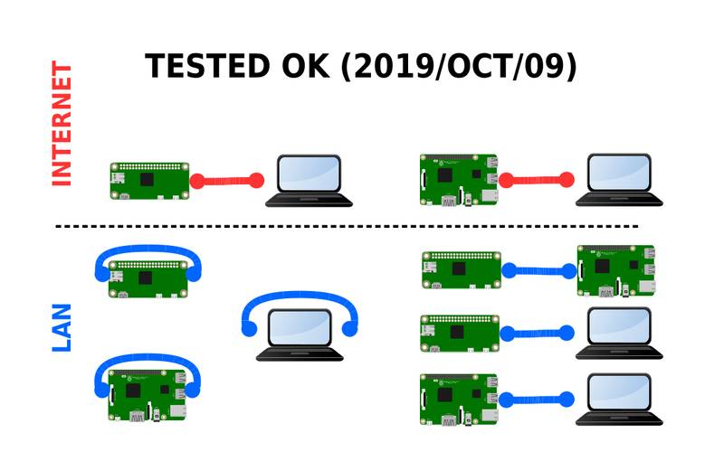

# webrtc-easy-power-sync
WebRTC DataChannel Simple by Sync Folder...
 
  
Pict 1  
 
 
This is the same WebRTC-Simple Datachannel sample tutorial, but this time using a folder-syncronization software/service to exchange signals (and start the connection).  
  
Since this tutorial sample uses the same Scripts as the original WebRTC tutorial sample (link below), looking at it first will help to understand the current version more easilly...
[WebRTC Simple Sample 1 Here](https://github.com/t2age/webrtc-easy-power)
  
A sync-folder is used to exchange the text signals, so, there is NO NEED of server script to perform this task!  
  
The tutorial was tested with the Open Source Syncthing software, but ANY sync soft/service should be OK...  
  
Before running the scripts, you need 2 devices with the sync soft/service running with a folder already syncronized (details below).  
  
The scripts also works on a single device WITHOUT any sync software running, you just need to create a normal folder to represent the sync-folder (see details on the picture of the "syncFolder").  
  
  

  
  
Pict 2  
  
  
Pict 3  
  
  
Pict 4  
  
  
Pict 5  
  
  
Pict 6  
  
  
Pict 7  
  
  
Pict 8  
  
  
Pict 9  
  
  
Pict 10  
  
  
Pict 11  
  
  
Pict 12  
  
  
Pict 13  
  

**The First WebRTC Simple Sample Tutorial here**  
[WebRTC Simple Sample Tutorial 1](https://github.com/t2age/webrtc-easy-power)  
  
  
**Run on Raspberry PI Zero ARMv6**  
If you want to run WebRTC on a ARMv6 Raspberry PI Zero, you need to compile NodeJS-WRTC from source code, here is the tutorial showing how to:  
[Build NodeJS WRTC Module from source](https://github.com/t2age/webrtc-armv6)  
  
  
**Sync Software**  
You can use ANY soft, service or protocol to create the sync folder and use it with the sample scripts, they are independent of the the sync mechanism, so there is no need to do any change to use them with different sync tools.  
  
  
**Syncthing Soft on Raspberry PI Zero**  
If you want to use the Open Source Syncthing software on the RPIZero, you will need to compile it from source, which is simple and easy, just follow the details on the Syncthing website...  
  
  
**Run both peers on the same PC(device)**  
If you want to test inside the same device (PC), you DON'T NEED any sync soft running, just need to build the syncFolder somewhere, with the sub folders and the 2 empty files (offer.txt and answer.txt) inside them, and then, run the scripts... because both scripts are on the same machine (device), the signals will be exchanged as if they are being syncronized... so, it will work OK...  
  
  
  
